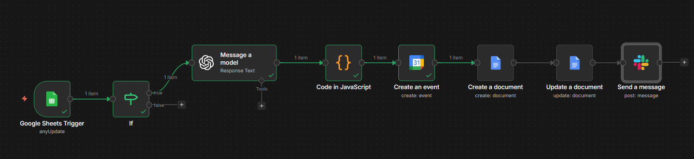
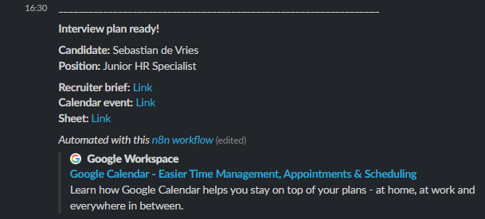
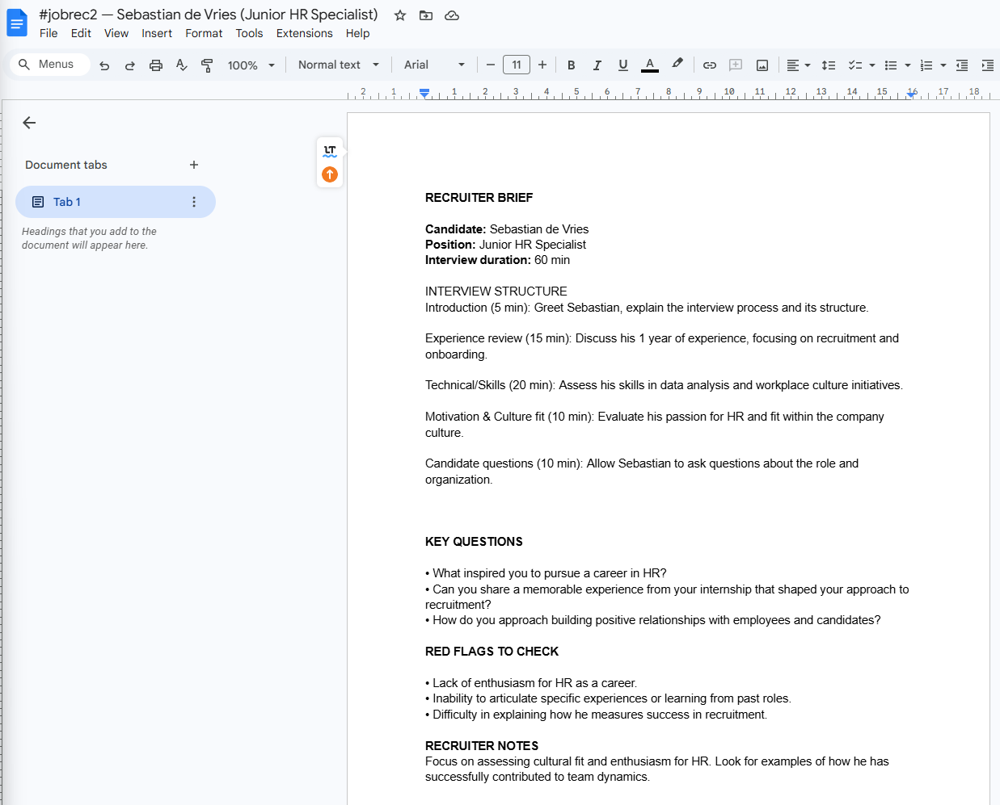
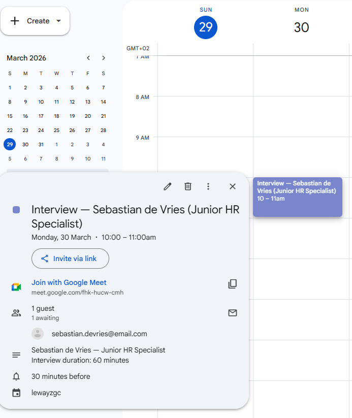

# 🤖 Interview Planner Agent

> Part of the [n8n HR Agents](/) project - a collection of AI-powered automation workflows for HR teams.

An n8n workflow that monitors the CV Ranking Google Sheet (built in [Agent 1](../agent-1-cv-filter)) and automatically generates a full interview plan whenever a recruiter marks a candidate as ready for interview. The agent creates a Google Calendar event with Google Meet, a private recruiter brief in Google Docs, and sends a Slack notification - all in seconds.

---

## 📸 Demo

### Workflow overview


### Slack notification with links


### Recruiter brief in Google Docs


### Google Calendar event with Google Meet


---

## ✨ Features

- **Status-based trigger** - monitors the CV Ranking sheet and fires only when a candidate's status changes to `interview`
- **AI-generated interview plan** - GPT-4o-mini creates a structured 60-minute interview plan with timed blocks, key questions, red flags to check, and recruiter notes
- **Private recruiter brief** - full interview plan saved to Google Docs with a unique reference number (`#jobrec01`, `#jobrec02`...) - never visible to the candidate
- **Clean calendar event** - Google Calendar invite with Google Meet link sent to the candidate, containing only basic info (no internal notes)
- **Slack notification** - DM to recruiter with clickable links to the brief, calendar event, and ranking sheet

---

## 🔧 Tech stack

| Tool | Purpose | Cost |
|------|---------|------|
| [n8n Cloud](https://n8n.io) | Workflow automation | Free trial / from €20/mo |
| Google Sheets API | Status trigger & candidate data | Free |
| OpenAI GPT-4o-mini | Interview plan generation | ~$0.01 per candidate |
| Google Calendar API | Interview event + Google Meet | Free |
| Google Docs API | Private recruiter brief | Free |
| Slack API | Recruiter notification | Free |

---

## 🗂️ Workflow nodes

```
Google Sheets Trigger (any update)
    └── IF (Status = "interview"?)
        ├── FALSE → stop
        └── TRUE → OpenAI Chat Model (generate interview plan)
            └── Code in JavaScript (parse JSON)
                └── Create an event (Google Calendar + Meet)
                    └── Create a document (Google Docs)
                        └── Update a document (insert brief content)
                            └── Send a message (Slack DM)
```

## 🔒 Privacy design

The workflow deliberately separates information visible to the candidate from information visible only to the recruiter:

| | Candidate sees | Recruiter sees |
|---|---|---|
| Calendar event | Name, date, time, Google Meet link | Same |
| Google Docs brief | Nothing | Full interview plan, red flags, recruiter notes |
| Slack message | Nothing | Links to all three resources |

---

## ⚠️ Known limitations

- **Scheduling** - the calendar event is always set to the next day at 10:00 AM. For production use, add a date picker or integrate with a scheduling tool like Calendly.
- **Single trigger per update** - if a recruiter accidentally changes status twice, two briefs and two calendar events will be created. A deduplication check can be added as a future improvement.
