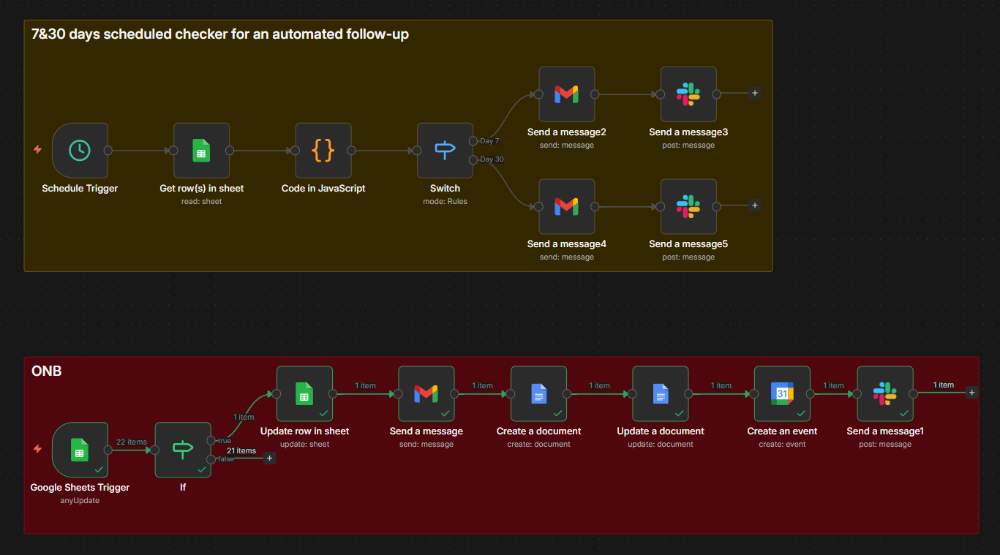
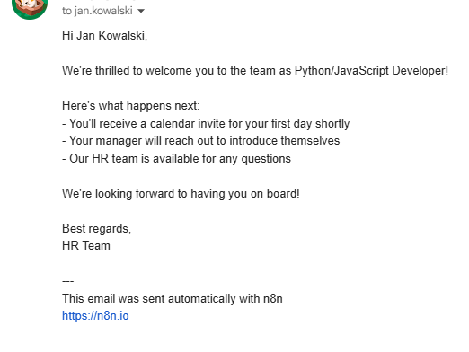
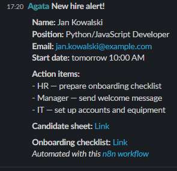
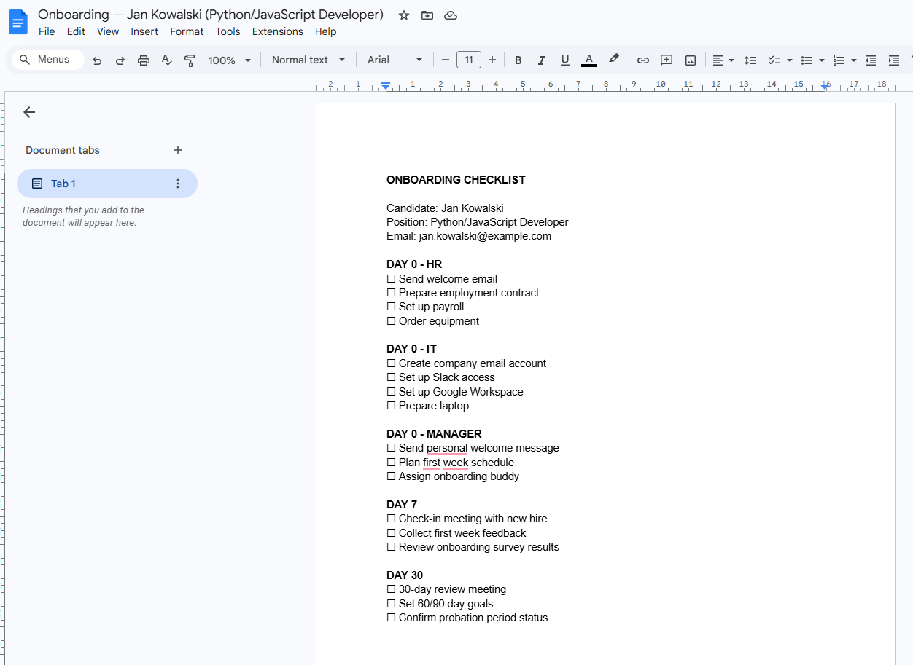
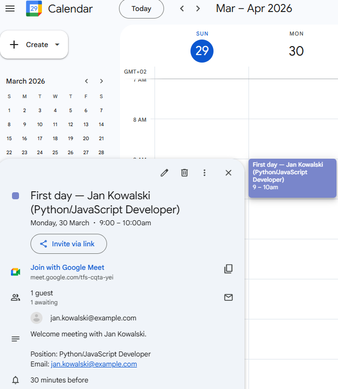

# 🤖 Agent 3 - Onboarding Agent

> Part of the [n8n HR Agents](/) project - a collection of AI-powered automation workflows for HR teams.

An n8n workflow that automatically kicks off the entire onboarding process the moment a recruiter marks a candidate as `active` in the CV Ranking sheet. The agent sends a welcome email, alerts the HR team and manager on Slack, creates a private onboarding checklist in Google Docs, and schedules a first-day meeting with Google Meet - then automatically follows up on Day 7 and Day 30.

---

## 📸 Demo

### Workflow overview


### Welcome email to new hire


### Slack alert for HR team (Day 0)


### Onboarding checklist in Google Docs


### Google Calendar first day event with Google Meet


---

## ✨ Features

- **Status-based trigger** - fires when a candidate's status changes to `active` in the CV Ranking sheet (same sheet as Agent 1 and 2)
- **Automatic date tracking** - records `active_since` date to power Day 7 and Day 30 follow-ups
- **Welcome email** - personalized email sent immediately to the new hire
- **HR & manager alert** - Slack notification with action items for HR, IT, and the hiring manager
- **Onboarding checklist** - private Google Docs document with tasks for HR, IT, and manager across Day 0, Day 7, and Day 30
- **First day calendar event** - Google Calendar invite with Google Meet link sent to the new hire
- **Day 7 follow-up** - automatic check-in email to the new hire + Slack reminder to the manager
- **Day 30 follow-up** - first month congratulations email + Slack action items for 30-day review

---

## 🗂️ Workflow structure

The workflow has two separate branches:

### Branch 1 - Day 0 (status trigger)
```
Google Sheets Trigger (status = "active")
    └── IF (status = "active"?)
        └── TRUE → Update row in sheet (save active_since date)
            └── Gmail (welcome email to new hire)
                └── Slack (alert for HR + manager)
                    └── Create a document (Google Docs checklist)
                        └── Update a document (insert checklist content)
                            └── Create an event (Google Calendar + Meet)
                                └── Slack (send checklist & calendar links to HR)
```

### Branch 2 - Day 7 & 30 (schedule trigger)
```
Schedule Trigger (every day at 8:00 AM)
    └── Get rows in sheet (all "active" employees)
        └── Code in JavaScript (check if today = Day 7 or Day 30)
            └── Switch
                ├── Day 7 → Gmail (check-in email) → Slack (manager reminder)
                └── Day 30 → Gmail (first month email) → Slack (review action items)
```

## 📅 Timeline

| Day | New hire receives | HR / manager receives |
|-----|------------------|-----------------------|
| 0 | Welcome email, calendar invite with Google Meet | Slack alert with action items, onboarding checklist link |
| 7 | Check-in email with feedback survey link | Slack reminder to schedule 1:1 |
| 30 | First month congratulations email | Slack with 30-day review action items |

---
